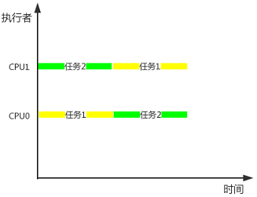
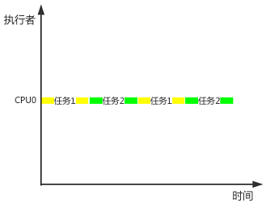
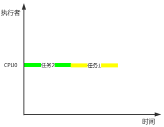

# 基础篇

[1. 为什么学习并发？]() 

在基础篇，我会以问答的形式将Java并发领域的知识点串起来。 
### 1. 为什么要学习并发？
要回答这个问题，我们先举个生活上的例子来说明什么是并发。
>在做饭的时候，我们通常会先去煲饭，在电饭煲煮饭的同时去炒菜，这样子比等饭煮熟
后再去炒菜能节省不少时间。 

* 并行：并行是指在一个时间点同时执行多项任务，如上述例子的煲饭和炒菜，可以同时
进行。
* 并发：并发是指在一个时间段内同时执行多项任务，每项任务分配一定的时间片去执行
，一项任务的执行不需要等待另一项任务的完成。
* 串行：同一时间段内只能执行一项任务，只有这项任务完成了才能执行下一项任务。

